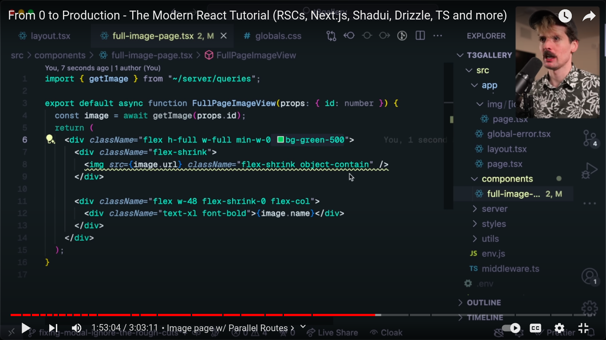
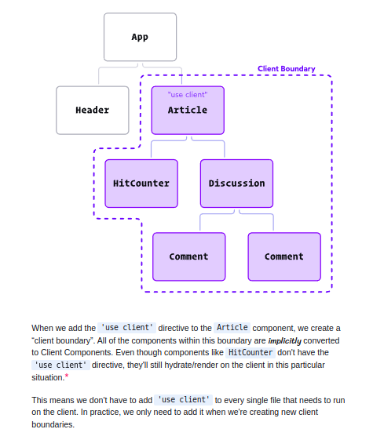

## TIdy up build process
in the next confit

```js
const config = {
  typescript: {
    ignoreBuildErrors: true,
  },
  eslint: {
    ignoreDuringBuilds: true,
  },
};
```
updating the database to run our current schema using `pnpm run db:push`

## destructive push: pnpm run db:push

ordering in descending order
const images = await db.query.images.findMany({
  orderBy: (model, {desc}) => desc(model.id)
})

## defining api endpoints inside of your next project

defined in app/api/[approutename]/route.ts
export function GET() {
  return new Response("Helo World")
}

## to query the response, we can do

`curl localhost:300/api/[apiroutename]
//output: hello world

## defining images to be added for only a specific user
He used varchar as a consequence of there being a good relationship between clerk and the images table
userId: varchar("userId", {length: 256}).notNull();

## placing all database base fetching logic in a single folder
He uses a queries file located in the server folder and defined and data fetching function there

## Implementing Sentry for error management in our applicaton
sentry.io

## LEarning more from examples of concepts that you want to lear
check : nexgram.vercel.app for examples on parallel routing



flex-shrink-0 : don't shrink the div, flex-shrink: shrink the div to take up the available space

uaing grid-rows-[auto,1fr] for a fixed top nav

const data = new Date();

heroIcons

loading spinner svg (svg spinner github repo)

## debugging issues

setting window.propertyName = function

then going on to the terminal and calling window.propertyName(); this invokes the function

difference between toLocalStrng() and toLocalDateString()

using posthug for analytics, plausible is another alternative but not as detailed as posthug

using posthug to identify user interaction with application

using the nextjs rewrites to enable data collection even if the user has add blockers on.

ratelimiting with upstash


## React Server Components

The key thing to understand is this: Server Components never re-render. They run once on the server to generate the UI.
The rendered value is sent to the client and locked in place. As far as React is concerned, this output is immutable, and will never change.*

This new paradigm introduces a new type of component, Server Components. These new components render exclusively on the server. Their code isn't included in the JS bundle, and so they never hydrate or re-render.

We still rely on Server Side Rendering to generate the initial HTML. React Server Components builds on top of that, allowing us to omit certain components from the client-side JavaScript bundle, ensuring they only run on the server.

In fact, it's even possible to use React Server Components without Server Side Rendering, though in practice, you'll get better results if you use them together. The React team has built a minimal RSC demo(opens in new tab) without SSR, if you'd like to see an example.

That standalone string at the top, 'use client', is how we signal to React that the component(s) in this file are Client Components, that they should be included in our JS bundles so that they can re-render on the client.

he React team added a rule: Client Components can only import other Client Components. That 'use client' directive means that these instances of HitCounter and Discussion(which were rendered as children of the article component and were server components) will need to become Client Components.

Client Boundaries




To be more precise, the 'use client' directive works at the file / module level. Any modules imported in a Client Component file must be Client Components as well. When the bundler bundles up our code, it'll follow these imports, after all!

I should also note that the HTML file is broken into chunks and streamed, so the browser can still paint the UI quickly, without having to wait for all the cruft in the <script> tag.

If you follow semantic HTML principles, most of your app should work even before React has hydrated. Links can be followed, forms can be submitted, accordions can be expanded and collapsed (using <details> and <summary>). For most projects, it's fine if it takes a few seconds for React to hydrate.

**additional: This is the big idea behind Bright(opens in new tab), a modern syntax-highlighting package designed to work with React Server Components.